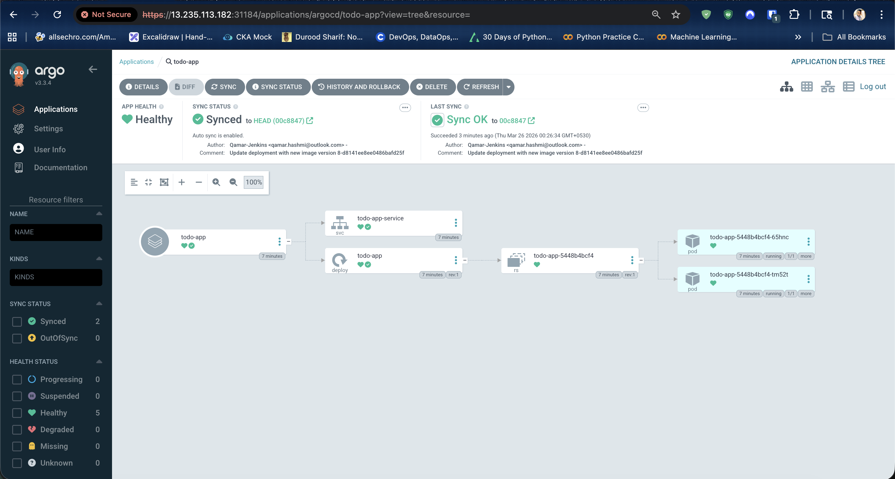
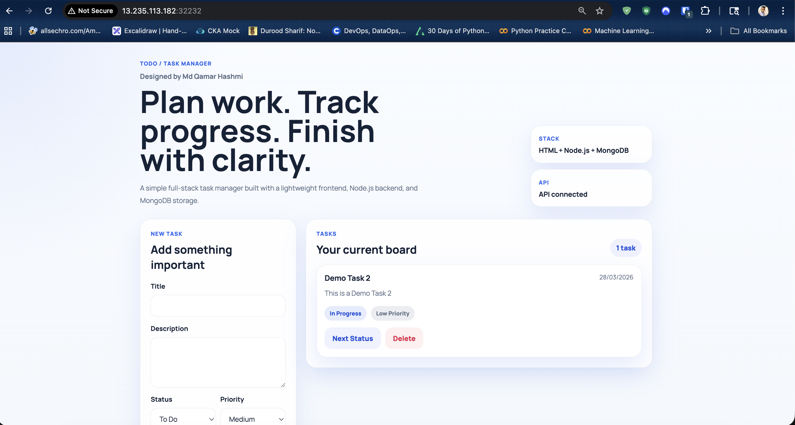

# Jenkins GitOps Kubernetes Deployment

This repository contains the Kubernetes manifests used to deploy the Todo Task Manager application with a GitOps workflow using Argo CD. The application runs on Kubernetes, exposes the frontend through a `NodePort` service, and reads the MongoDB connection string from a Kubernetes secret that is applied manually.

## Project Structure

```text
.
├── README.md
├── docs/
│   └── images/
│       ├── argocd-application.png
│       └── todo-app-ui.png
└── todo-app-k8s-manifest/
    ├── deployment.yaml
    ├── secrets.yaml
    └── service.yaml
```

## Kubernetes Resources

- `deployment.yaml`: Deploys the `todo-app` container with 2 replicas.
- `service.yaml`: Exposes the application through a `NodePort` service.
- `secrets.yaml`: Defines the `todo-app-secret` secret used by the application for `MONGO_URI`.

## Deployment Flow

1. Jenkins builds and pushes the application image.
2. The Kubernetes manifests in this repository are used as the GitOps source.
3. Argo CD watches this repository and syncs the application to the Kubernetes cluster.
4. The MongoDB secret is applied manually in the cluster before syncing the application workload.

## Important Missing Step: Secret Applied Manually

The Kubernetes secret is not managed through the Argo CD application sync in this setup. It was deployed manually so the application could read the MongoDB connection string at runtime.

Reason:
- The secret contains sensitive database credentials.
- The file is excluded through `.gitignore`, so it is not intended to be committed as part of the normal GitOps sync flow.

Manual secret deployment command:

```bash
kubectl apply -f todo-app-k8s-manifest/secrets.yaml
```

You should apply this secret first, then allow Argo CD to sync the deployment and service resources.

## Argo CD Application Using UI

The Argo CD application was created from the Argo CD web portal instead of only using a declarative `Application` manifest.

### Steps followed in the Argo CD UI

1. Open the Argo CD portal.
2. Click `NEW APP`.
3. Enter the application name: `todo-app`.
4. Select the target project, usually `default`.
5. Set the sync policy as needed (`Manual` or `Automatic`).
6. Set the repository URL to this Git repository.
7. Set the path to `todo-app-k8s-manifest`.
8. Choose the target cluster and namespace.
9. Create the application.
10. Apply the secret manually with `kubectl apply -f todo-app-k8s-manifest/secrets.yaml`.
11. Click `SYNC` in Argo CD to deploy the application resources.

## Accessing the Application

- Argo CD portal: accessed through the Argo CD UI endpoint exposed on the cluster.
- Todo application: accessed through the Kubernetes `NodePort` service on the worker or node IP.

Example URLs used during validation:

- Argo CD UI: `https://13.235.113.182:31184`
- Todo app UI: `http://13.235.113.182:32232`

If your cluster assigns a different NodePort, check it with:

```bash
kubectl get svc todo-app-service
```

## Screenshots

### Argo CD Portal Application View

This screenshot shows the `todo-app` Argo CD application in a healthy and synced state.



### Todo Application UI

This screenshot shows the deployed Todo Task Manager application running successfully from the Kubernetes service.



## Notes

- The deployment uses the container image `hashmi111/todo-app:latest`.
- The application expects the `MONGO_URI` environment variable from the `todo-app-secret` secret.
- Readiness and liveness probes are configured on `/api/health` at port `3000`.
